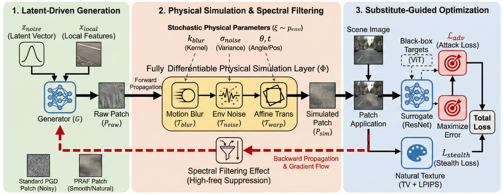

# Stealthy and Robust: A Physically-Realizable Black-Box Attack Framework for Embodied Semantic Segmentation

[](https://opensource.org/licenses/MIT)
[](https://ijcai.org/)

这是一个针对具身智能（Embodied AI）语义分割模型的物理黑盒攻击框架（**PRAF**）的官方实现介绍。

## 📖 简介 (Introduction)

语义分割是自动驾驶车辆和人形机器人感知环境的基础。然而，现有的物理对抗攻击面临着两大挑战：**Sim-to-Real（仿真到现实）的差距**以及**跨模型架构（CNN vs Transformer）的迁移性**。

本项目提出了 **PRAF (Physically-Realizable Attack Framework)**，这是一个闭环的对抗补丁生成框架。它通过引入可微分的物理仿真层，在优化过程中模拟现实世界的畸变（如运动模糊、光照变化），从而生成既隐蔽又鲁棒的对抗补丁。

**核心贡献：**
1.  **物理鲁棒性**：通过可微分物理仿真层，生成的补丁能抵抗剧烈的相机抖动、运动模糊和视角变化。
2.  **跨架构迁移**：仅使用 ResNet-50 作为替代模型，攻击即可成功迁移到 SegFormer、Mask2Former 等先进的 Transformer 架构。
3.  **多平台验证**：在**智能无人车**（道路场景）和**人形机器人**（动态走廊场景）上进行了广泛的物理世界验证。

## 🚀 方法论 (Methodology)

PRAF 框架包含三个核心组件：

1.  **潜在变量驱动的生成器 (Latent-Driven Generator)**：从混合噪声分布中生成补丁，避免对替代模型的像素级过拟合。
2.  **可微分物理仿真层 (Differentiable Physical Simulation Layer, $\Phi$)**：
    * 在训练循环中模拟物理退化（运动模糊、环境噪声）。
    * **机制**：充当光谱低通滤波器，抑制高频纹理噪声，迫使生成器学习鲁棒的低频结构特征。
3.  **替代模型引导优化 (Substitute-Guided Optimization)**：利用白盒替代模型（ResNet）的梯度，结合对抗损失和隐蔽性损失（TV + LPIPS）进行迭代更新。


*(注：此处对应论文中的 Figure 2)*

## 📊 实验结果 (Results)

### 1. 数字域跨架构迁移性 (Digital Transferability)

在使用 ResNet-50 作为替代模型攻击黑盒目标时，PRAF 表现优于现有的 SOTA 方法（如 FSPGD, SEA, GenSeg）：

| Attack Method | DeepLabV3+ (CNN) | SegFormer (ViT) | Mask2Former (ViT) |
| :--- | :---: | :---: | :---: |
| FSPGD (Baseline) | 66.8% | 30.2% | 38.9% |
| GenSeg (Generative) | 32.4% | 32.4% | 25.8% |
| **PRAF (Ours)** | **63.5%** | **48.5%** | **45.1%** |

> **结论**：PRAF 显著提高了从 CNN 到 Transformer 的攻击迁移率（在 SegFormer 上 mIoU 下降达 48.5%）。

### 2. 物理世界鲁棒性 (Physical Real-World Robustness)

我们在两种机器人平台上进行了实地测试：

* **平台 A：智能无人车 (Intelligent Vehicle)** - 低速、道路场景
* **平台 B：人形机器人 (Humanoid Robot)** - 动态、剧烈抖动、走廊场景

| 场景条件 | 攻击成功率 (ASR) | 说明 |
| :--- | :---: | :--- |
| **无人车 (静止)** | **95.4%** | 极高成功率 |
| **无人车 (移动)** | **88.2%** | 抗运动模糊 |
| **人形机器人 (室内)** | **91.2%** | 抗行走抖动 |
| **人形机器人 (室外)** | **85.6%** | 抗复杂光照 |

### 3. 环境与防御适应性

* **视角鲁棒性**：在 60° 倾斜视角下，标准 Adv-Patch 成功率仅为 12.5%，而 PRAF 保持在 **62.1%**。
* **防御规避**：有效绕过 Total Variance Minimization (TVM) 和 Denoising Autoencoder (DAE) 等预处理防御。


*(注：此处对应论文中的 Figure 3 或 Figure 5)*

## 🛠️ 快速开始 (Quick Start)

### 环境依赖
```bash
pip install -r requirements.txt